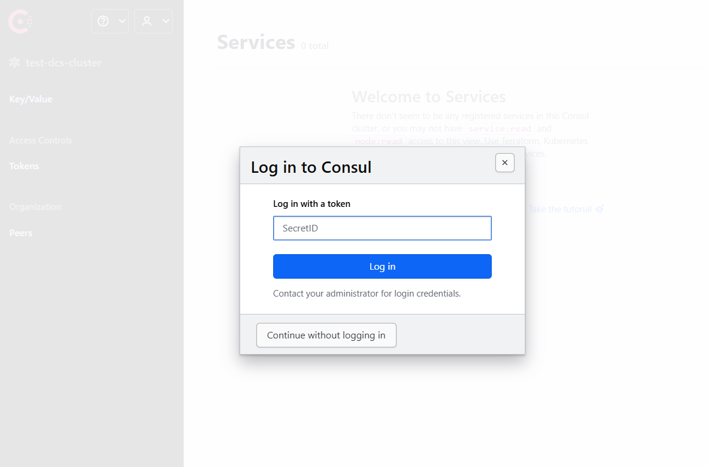
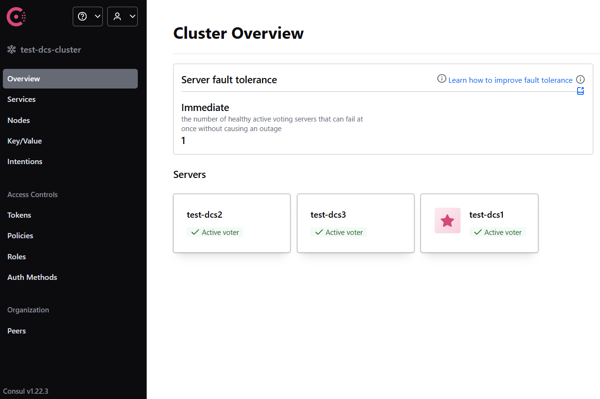
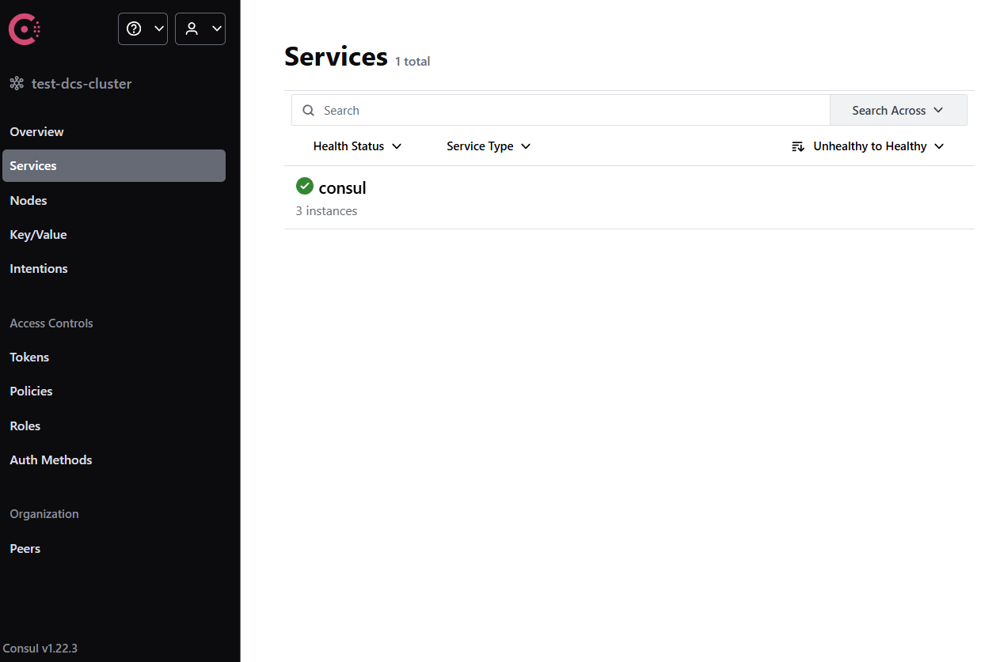
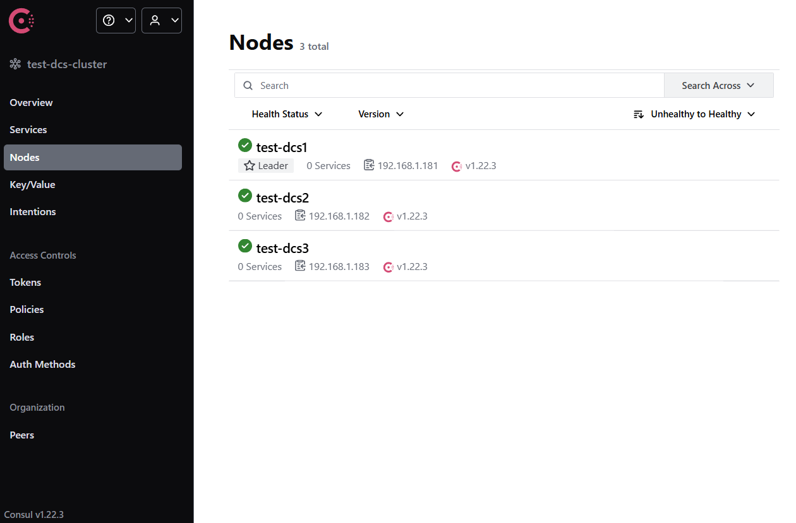

# Настройка кластера Patroni + Consul + VIP-manager

## 1. Оборудование и ПО

__настроим 6 виртуальных машин__

``` text
- три хоста - кластер DSC   [ test-dcs1, test-dcs2, test-dcs3 ]
- три хоста - кластер СУБД  [ test-db1,  test-db2,  test-db3 ]
```

параметры разыменования хостов задаём в файле /etc/hosts<br> 
так как у нас нет контроллера домена<br>
( на всех хостах - добавляем - например )

```
192.168.1.181   test-dcs1  test-dcs1.test.local
192.168.1.182   test-dcs2  test-dcs2.test.local
192.168.1.183   test-dcs3  test-dcs3.test.local
192.168.1.141   test-db1   test-db1.test.local
192.168.1.142   test-db2   test-db2.test.local
192.168.1.143   test-db3   test-db3.test.local

192.168.1.140   test-db-cl test-db-cl.test.local
```

__- программное обеспечение__

``` text
- Astra Linux 1.8  (based on Debian 12)
- Consul 1.22.3
- Patroni 4.1.0 
- PostgresPro 1C 18  (free edition PostgresPro)
- Vip-manager 4.0
```

__- план__

``` text
- кластер  Consul + Patroni + Vip-manager
- как настроить синхронную реплику
- Patroni callback как замена Vip-manager
```

## 2. Consul - кластер

#### 2.1 Установка Consul

на каждом хосте DCS загружаем выполняемый файл Consul и создаем рабочие каталоги<br>
(1.22.3 - последняя верси на январь 2026)

``` bash
wget https://hashicorp-releases.mcs.mail.ru/consul/1.22.3/consul_1.22.3_linux_amd64.zip -O /tmp/consul.zip
sudo unzip /tmp/consul.zip -d /usr/bin
sudo chmod +x /usr/bin/consul

sudo groupadd consul
sudo useradd -m -d /var/lib/consul -g consul -r -c 'Consul DCS service' consul
sudo mkdir -p /etc/consul.d /var/lib/consul/data /var/log/consul
sudo chown -R consul: /etc/consul.d /var/lib/consul/data /var/log/consul
sudo chmod 775 /etc/consul.d /var/lib/consul /var/lib/consul/data /var/log/consul
```

/etc/consul.d         - каталог конфигураций<br> 
/var/lib/consul/data  - каталог для данных ноды кластера DCS<br>
/var/log/consul       - каталог для логов<br>

#### 2.2 Настройка и запуск Consul кластера

__получаем ключ шифрования на любом хосте кластера (один раз)__

``` bash
consul keygen
> L5o6P57/auweOjNSgJ8sOhoMf4BbiaTyPnDw097p/kk=
```

полученное значение надо использовать в параметре "encrypt" конфигурации

__- настройка для первого запуска__<br>
__создаём файл__ _/etc/consul.d/config.json_  - файл на каждом хосте кластера

``` json
{
     "bind_addr": "0.0.0.0",
     "advertise_addr": "{{ GetInterfaceIP `eth0` }}",
     "bootstrap_expect": 3,
     "client_addr": "0.0.0.0",
     "datacenter": "test-dcs-cluster",
     "node_name": "test-dcs1",
     "data_dir": "/var/lib/consul/data",
     "domain": "consul",
     "disable_update_check": true,
     "enable_local_script_checks": true,
     "dns_config": {
         "enable_truncate": true,
         "only_passing": true
     },
     "enable_syslog": true,
     "encrypt": "L5o6P57/auweOjNSgJ8sOhoMf4BbiaTyPnDw097p/kk=",
     "leave_on_terminate": true,
     "log_level": "INFO",
     "log_file": "/var/log/consul/",
     "log_rotate_duration": "24h",
     "log_rotate_max_files": 30,
     "rejoin_after_leave": true,
     "retry_join": [ "test-dcs1", "test-dcs2", "test-dcs3" ],
     "server": true,
     "ui_config": { "enabled": true },
     "primary_datacenter": "test-dcs-cluster",
     "acl": {
         "enabled": true,
         "default_policy": "deny",
         "enable_token_persistence": true
     }
}
```

__важные параметры__

``` text
"retry_join": [ test-dcs1, test-dcs2, test-dcs3 ]  - сразу перечислены хосты кластера DCS
"datacenter": "test-dcs-cluster"  - имя кластера DCS
"node_name": "test-dcs1"   -  имя текущей ноды кластера DCS ( у всех разное !)
"primary_datacenter": "test-dcs-cluster" - основной кластер DCS - текущий
"encrypt": "L5o6P57/auweOjNSgJ8sOhoMf4BbiaTyPnDw097p/kk=" - ключ шифрования кластера
```

__проверка правильности конфигурации__

``` bash
consul validate /etc/consul.d/config.json
> bootstrap_expect > 0: expecting 3 servers
> Configuration is valid!
```

__создаём файл для службы Consul__ - _/usr/lib/systemd/system/consul.service_

``` service
[Unit]
Description=Consul Service Discovery Agent
Documentation=https://www.consul.io/
After=network-online.target
Wants=network-online.target

[Service]
Type=simple
User=consul
Group=consul
PIDFile=/run/consul/consul.pid
RuntimeDirectory=consul
PermissionsStartOnly=true
ExecStart=/usr/bin/consul agent -config-dir=/etc/consul.d -pid-file=/run/consul/consul.pid
ExecReload=/bin/kill -HUP $MAINPID
KillSignal=SIGINT
TimeoutStopSec=5
Restart=on-failure
SyslogIdentifier=consul

[Install]
WantedBy=multi-user.target
```

__настройка и запуск__
( на каждом узле кластера )

``` bash
sudo systemctl daemon-reload
sudo systemctl start consul
```

#### 2.3 Настройка Consul ACL

__получение мастер токена__<br>
( на одном из хостов кластера)

``` bash
consul acl bootstrap
> AccessorID:       01db8610-18c0-52b3-ec45-34f15ca01f55
> SecretID:         b5eb2128-eb32-7cbe-77fe-45959c2a444a
> Description:      Bootstrap Token (Global Management)
> Local:            false
> Create Time:      2026-01-28 11:31:55.748746127 +0300 MSK
> Policies:
>   00000000-0000-0000-0000-000000000001 - global-management
```

нам нужно значение SecterID - это мастер токен _(b5eb2128-eb32-7cbe-77fe-45959c2a444a)_<br>

если присвоить это значение переменной окружения CONSUL_HTTP_TOKEN<br>
то можно через команды консоли проверить состояние кластера

``` bash
export CONSUL_HTTP_TOKEN=b5eb2128-eb32-7cbe-77fe-45959c2a444a
consul members
> Node       Address             Status  Type    Build   Protocol  DC                Partition  Segment
> test-dcs1  192.168.1.181:8301  alive   server  1.22.3  2         test-dcs-cluster  default    <all>
> test-dcs2  192.168.1.182:8301  alive   server  1.22.3  2         test-dcs-cluster  default    <all>
> test-dcs3  192.168.1.183:8301  alive   server  1.22.3  2         test-dcs-cluster  default    <all>
```

для текущего пользователя можно сохранить в профайле данный токен<br>
(можно на каждом хосте кластера такую настройку сделать)

``` bash
test -f ~/.profile  &&  sed -i "/CONSUL_HTTP/d"  ~/.profile
echo "export CONSUL_HTTP_TOKEN=b5eb2128-eb32-7cbe-77fe-45959c2a444a" >> ~/.profile
```

только надо пересоздать сессию подключения

__создание политик ACL__ для сервисов кластера DCS<br>

** создадим файл  policy-agent.hcl  для описания простого агентского доступа (хосты)

``` hcl
node_prefix "" {
  policy = "write"
}
node "" {
  policy = "write"
}
service_prefix "" {
  policy = "write"
}
service "" {
  policy = "write"
}
```

** и файл policy-patroni.hcl  для описания доступа сервиса Patroni

``` hcl
service_prefix "" {
   policy = "write"
}

session_prefix "" {
  policy = "write"
}

key_prefix "" {
  policy = "write"
}

node_prefix "" {
  policy = "read"
}

agent_prefix "" {
  policy = "read"
}
```

Загрузим эти описания на кластер DCS и получим токены доступа

``` bash
export CONSUL_HTTP_TOKEN=b5eb2128-eb32-7cbe-77fe-45959c2a444a

consul acl policy create -name "agent" -rules @./policy-agent.hcl
> ID:           8abe907f-00eb-eb15-44e7-c2f553ac623a
> Name:         agent
> ...

consul acl token create -description "Token for Agent" -policy-name agent
> AccessorID:       1f2d33c8-29db-d786-eaef-d9da0f256d46
> SecretID:         61655c0a-07ff-7bf7-e22a-c855e2ec0f39
> Description:      Token for Agent
> Local:            false
> Create Time:      2026-01-28 12:56:29.528666389 +0300 MSK
> Policies:
>    8abe907f-00eb-eb15-44e7-c2f553ac623a - agent

consul acl policy create -name "patroni" -rules @./policy-patroni.hcl
> ID:           d4b0e4d2-5a79-436e-295a-b9c6ceaf0254
> Name:         patroni
> ...

consul acl token create -description "Token for Patroni" -policy-name patroni
> AccessorID:       a71ec65a-baec-bb88-ed18-14717dbb0c2b
> SecretID:         ea5a1ccc-e063-20c6-46b8-d751e7750111
> Description:      Token for Patroni
> Local:            false
> Create Time:      2026-01-28 12:59:53.186638812 +0300 MSK
> Policies:
>    d4b0e4d2-5a79-436e-295a-b9c6ceaf0254 - patroni
```

__получили токены__ (значения SecretID) <br> 
для агента  - 61655c0a-07ff-7bf7-e22a-c855e2ec0f39<br>
для Patroni - ea5a1ccc-e063-20c6-46b8-d751e7750111<br>
будем их использовать при дальнейшей конфигурации

__Также роли и токены можно создавать на WEB странице кластера__

#### 2.4 Настройка ACL хостов кластера DCS

на каждом хосте кластера DCS настроим ACL доступ (как хост)

``` bash
export CONSUL_HTTP_TOKEN=b5eb2128-eb32-7cbe-77fe-45959c2a444a
consul acl set-agent-token agent 61655c0a-07ff-7bf7-e22a-c855e2ec0f39
> ACL token "agent" set successfully
```

#### 2.5 Основные команды работы с Consul из консоли

``` bash
-- вывод списка хостов данного сегмента 
consul members
> Node       Address             Status  Type    Build   Protocol  DC                Partition  Segment
> test-dcs1  192.168.1.181:8301  alive   server  1.22.3  2         test-dcs-cluster  default    <all>
> test-dcs2  192.168.1.182:8301  alive   server  1.22.3  2         test-dcs-cluster  default    <all>
> test-dcs3  192.168.1.183:8301  alive   server  1.22.3  2         test-dcs-cluster  default    <all>

-- вывод списка серверов кластера
consul operator raft list-peers
> Node       ID                                    Address             State     Voter  RaftProtocol  Commit Index  Trails Leader By
> test-dcs1  eab7bb8b-3969-3008-5d91-e103688b0eae  192.168.1.181:8300  leader    true   3             2757          -
> test-dcs2  3b536188-8dec-dbce-f80f-07c8af70651c  192.168.1.182:8300  follower  true   3             2757          0 commits
> test-dcs3  ac70217d-f375-5509-3114-19ac8a125f2b  192.168.1.183:8300  follower  true   3             2757          0 commits

-- 'тихая' смена лидера в кластере
consul operator raft transfer-leader
> Success
```

#### 2.6 Web-интерфейс Consul

открываем в браузере страницу по порту 8500<br>
http://192.168.1.181:8500     (192.168.1.181 - адрес хоста  test-dns1)<br>

Далее вводим в качестве пароля - мастер токен<br>

_Страница состояния кластера Consul_<br>


_Страница сервисов кластера Consul_<br>


_Страница хостов подключенных к кластеру Consul_<br>



#### 2.7 Consul - как агент на серверах Patroni

__на хостах СУБД__  
** выполняем п.2.1 - установка Consul<br>
** выполняем п.2.2 - только<br>
  ключ шифрования уже есть общий и для агентов<br>
  также понадобится токен ACL для агента<br>
  файл конфигурации /etc/consul.d/config.json

``` json
{
     "bind_addr": "{{ GetInterfaceIP `eth0` }}",
     "client_addr": "127.0.0.1",
     "datacenter": "test-dcs-cluster",
     "node_name": "test-db1",
     "data_dir": "/var/lib/consul/data",
     "disable_update_check": true,
     "enable_local_script_checks": true,
     "enable_syslog": true,
     "encrypt": "L5o6P57/auweOjNSgJ8sOhoMf4BbiaTyPnDw097p/kk=",
     "leave_on_terminate": true,
     "log_level": "WARN",
     "log_file": "/var/log/consul/",
     "log_rotate_duration": "24h",
     "log_rotate_max_files": 30,
     "retry_join": [ "test-dcs1", "test-dcs2", "test-dcs3" ],
     "server": false,
     "acl": {
         "enabled": true,
         "tokens": {
             "default": "61655c0a-07ff-7bf7-e22a-c855e2ec0f39"
         }
     }
}
```

  файл службы  /usr/lib/systemd/system/consul.service - такой-же

  также проверяем валидность конфигурационного файла

  запускаем службу

``` bash
sudo systemctl daemon-reload
sudo systemctl start consul
```  

контролируем добавление хоста через командную строку или WEB-интерфейс

```
consul members
> Node       Address             Status  Type    Build   Protocol  DC                Partition  Segment
> test-dcs1  192.168.1.181:8301  alive   server  1.22.3  2         test-dcs-cluster  default    <all>
> test-dcs2  192.168.1.182:8301  alive   server  1.22.3  2         test-dcs-cluster  default    <all>
> test-dcs3  192.168.1.183:8301  alive   server  1.22.3  2         test-dcs-cluster  default    <all>
> test-db1   192.168.1.141:8301  alive   client  1.22.3  2         test-dcs-cluster  default    <default>
> test-db2   192.168.1.142:8301  alive   client  1.22.3  2         test-dcs-cluster  default    <default>
> test-db3   192.168.1.143:8301  alive   client  1.22.3  2         test-dcs-cluster  default    <default>
```

## 3. PostgreSQL

__- на 3-х хостах кластера СУБД - разворачиваем PostgresPro 1C 18__<br>
_-- останавливаем службу и проверяем установленные Локальные языки_<br>
_-- во время инициализации кластера PostgreSQL будет определять текущую "локаль" и использует её_<br>

``` bash
wget https://repo.postgrespro.ru/1c/1c-18/keys/pgpro-repo-add.sh
chmod +x ./pgpro-repo-add.sh
sudo ./pgpro-repo-add.sh 
sudo apt -y install postgrespro-1c-18 
...
  -- выключаем автозагрузку сразу с остановкой службы
sudo systemctl disable --now postgrespro-1c-18

  -- Patroni сам будет запускать сервер PostgreSQL

  -- проверяем текущую локаль
locale
> LANG=ru_RU.UTF-8
> LANGUAGE=
> LC_CTYPE="ru_RU.UTF-8"
> LC_NUMERIC="ru_RU.UTF-8"
> ...

  -- проверяем установленные локали
locale -a    
> C
> C.utf8
> en_US.utf8
> POSIX
> ru_RU.utf8

  -- локаль текущая ru_RU.UTF-8
  -- локаль en_US.utf8 установлена - будет использоваться для логов
```

## 4. Patroni

#### 4.1 Рабочие каталоги

Создаём рабочие папки Patroni и для БД<br>
для БД желательно размещать данные на другом диске<br>
но в данном тесте просто сделаем рабочий каталог БД  в /
( на каждом хосте кластера БД )

``` bash
sudo mkdir -p /pgdata
sudo mkdir -p /opt/patroni
sudo mkdir -p /var/log/patroni
sudo chown -R postgres: /pgdata /opt/patroni /var/log/patroni
sudo chmod -R 755 /pgdata /opt/patroni /var/log/patroni
```

#### 4.2 Python - виртуальное окружение

Patroni программа написанная на Python<br>
Желательно запускать программы в отдельном виртуальном окружении (песочнице)<br>
Так и сделаем

Создаём новое виртуальное окружение Python<br>
Делаем всё от пользователя __postgres__ от него и будет запускаться служба
( на каждом хосте кластера БД )

``` bash
-- дополниетльные модули для Python
sudo apt -y install python3-pip python3-venv
-- создаём виртуальное окружение
sudo su - postgres -c "python3 -m venv /opt/patroni"
-- настраиваем активацию виртуального
-- окружения при подключении пользователя postgres
sudo test -f  ~postgres/.profile  &&  sudo chown postgres: ~postgres/.profile
sudo su - postgres -c "echo 'source /opt/patroni/bin/activate' >> ~/.profile"
```

_теперь при подключении пользователем postgres_<br>
_активируется виртуальное окружение_<br>
_и на это будет указывать изменившаяся строка приглашения_

``` bash
astra@test-db1:~$ sudo su - postgres
(patroni) postgres@test-db1:~$
```

#### 4.3 Установка Patroni

Для работы Patroni требуются также дополнительные библиотеки<br>
И желательно обновить pip - менеджер библиотек Python<br>
Делаем всё в виртульном окружении и это не будет влиять на систему 
( на каждом хосте кластера БД )

``` bash
-- обновление дополнительных системных модулей Python
sudo su - postgres -c "python3 -m pip install --upgrade pip"
sudo su - postgres -c "pip install --upgrade  wheel"
sudo su - postgres -c "pip install --upgrade  setuptools"
-- клиент Consul для Python
sudo su - postgres -c "pip install --upgrade  py_consul"
-- клиент PostgreSQL для Python
sudo su - postgres -c "pip install --upgrade  psycopg"
sudo su - postgres -c "pip install --upgrade  psycopg_binary"
-- установка Patroni
sudo su - postgres -c "pip install --upgrade  patroni"
```

#### 4.4 Настройка Patroni

Для настройки нам нужны расчитанные параметры для сервера СУБД PostgreSQL<br>
Версия PostgresPro 1C - удобна тем что,<br> 
есть уже расчитанные параметры согласно характеристик хоста<br>
Вот добавленные параметры в файл postgresql.conf
//  для хоста  2 cpu 2 gb ram 16 gb hdd

``` conf
#------------------------------------------------------------------------------
# The following settings were added by pgpro_tune.
# pgpro_tune was run with the following options:
# -D /var/lib/pgpro/1c-18/data --config-file=/var/lib/pgpro/1c-18/data/postgresql.conf
#------------------------------------------------------------------------------
# Memory configuration
shared_buffers = 489MB
effective_cache_size = 979MB
max_connections = 61
work_mem = 32MB
temp_buffers = 16MB
maintenance_work_mem = 122MB
autovacuum_work_mem = 61MB
# Vacuum and bgwriter configuration
autovacuum_max_workers = 4
vacuum_cost_limit = 400
autovacuum_naptime = 20s
autovacuum_analyze_scale_factor = '0.005'
bgwriter_delay = 20ms
bgwriter_lru_multiplier = '4.0'
bgwriter_lru_maxpages = 4000
# Additional configuration
track_activity_query_size = 10kB
default_statistics_target = 800
wal_compression = lz4
default_toast_compression = lz4
log_lock_waits = on
log_connections = on
log_disconnections = on
max_wal_size = 4GB
min_wal_size = 2GB
effective_io_concurrency = 200 #  for SSD
#effective_io_concurrency = 500 # for NVMe
#effective_io_concurrency = 1           # for HDD
random_page_cost = '1.1' # for NVMe SSD
#random_page_cost = 1.3  # for SATA SSD
#random_page_cost = 4.0  # for HDD
jit = off
#------------------------------------------------------------------------------
# End of settings added by pgpro_tune 
#------------------------------------------------------------------------------
```
_учитывая эти данные - составим настройки тестового стенда_

Настройка находится конфигурационном файле  _/opt/patroni/patroni.yml_<br>
( файлы YAML очень чувствительны к отступам - внимательно! )

``` yaml
name: test-db1
namespace: /db/
scope: test

watchdog:
  mode: off

log:
  level: INFO
  format: '%(asctime)s %(levelname)s: %(message)s'
  dateformat: ''
  max_queue_size: 1000
  dir: /var/log/patroni/
  file_num: 4
  file_size: 25000000
  loggers:
    postgres.postmaster: INFO

restapi:
  listen: 0.0.0.0:8008
  connect_address: test-db1:8008
  authentication:
    username: patroni
    password: patroni

consul:
  host: "localhost:8500"
  register_service: true
  token: "ea5a1ccc-e063-20c6-46b8-d751e7750111"

bootstrap:
  dcs:
    ttl: 30
    loop_wait: 10
    retry_timeout: 10
    maximum_lag_on_failover: 1048576
    master_start_timeout: 300
    postgresql:
      use_pg_rewind: true
      pg_hba:
        - local   all             postgres                                peer
        - local   all             all                                     md5
        - host    all             all             127.0.0.1/32            md5
        - local   replication     all                                     peer
        - host    replication     all             127.0.0.1/32            md5
        - host    replication     replicator      samenet                 md5
        - host    all             all             0.0.0.0/0               md5
      use_slots: true
      parameters:
        checkpoint_timeout: '15min'
        commit_delay: 1000
        hot_standby: on
        lc_messages: en_US.UTF-8
        log_connections: on
        log_directory: 'log'
        logging_collector: on
        maintenance_work_mem: '122MB'
        max_connections: 100
        max_files_per_process: 10000
        max_locks_per_transaction: 256
        max_parallel_maintenance_workers: 2
        max_parallel_workers_per_gather: 0
        max_replication_slots: 5
        max_wal_senders: 5
        max_wal_size: '4GB'
        min_wal_size: '2GB'
        shared_buffers: '489MB'
        standard_conforming_strings: off
        temp_buffers: '16MB'
        unix_socket_directories: '/tmp/'
        vacuum_cost_limit: 400
        wal_keep_segments: 8
        wal_level: replica
        work_mem: '32MB'

  initdb:
    - encoding: UTF8
    - data-checksums
    - locale: ru_RU.UTF-8

postgresql:
  listen: 0.0.0.0:5432
  connect_address: test-db1:5432
  config_dir: /pgdata/test
  bin_dir: /opt/pgpro/1c-18/bin/
  data_dir: /pgdata/test
  pgpass: /tmp/pgpass
  authentication:
    superuser:
      username: postgres
      password: 'postgres'
    replication:
      username: replicator
      password: 'replicator'
    rewind:
      username: postgres
      password: 'postgres'

  parameters:
    logging_collector: on
    log_directory: 'log'

tags:
  nofailover: false
  noloadbalance: false
  clonefrom: false
  nosync: false
```

Для каждого хоста надо указывать собственное имя,<br>
где есть параметры для подключения<br>

__Описание некоторых параметров:__

``` text
'name' - имя хоста при регистрации на DCS в кластере
'namespace' - имя корневого ключа на DCS
'scope' - имя сервиса на DCS
'consul'.'token' - значение токена Consul для Patroni
'bootstrap' - раздел первой инициализации кластера
```

__Проверка файла конфигурации__

``` bash
patroni --validate-config /opt/patroni/patroni.yml
```

Так как запускаем Patroni в отдельном виртуальном окружении Python<br>
Для организации службы задаем также пути к нужным каталогам<br>
Обязательно нужно определить<br> 
какое значение у переменной PATH пользователя postgres<br>
добавить ещё путь к выполняемым файлам postgresql

Файл опмсания службы - _/usr/lib/systemd/system/patroni.service_

``` service
[Unit]
Description=Runners to orchestrate a high-availability PostgreSQL
After=syslog.target network.target

[Service]
Type=simple
User=postgres
Group=postgres
WorkingDirectory=/opt/patroni/bin
Environment='PATH=/opt/patroni/bin:/opt/pgpro/1c-18/bin:/usr/local/bin:/usr/bin:/bin'
ExecStart=/opt/patroni/bin/patroni /opt/patroni/patroni.yml
ExecReload=/bin/kill -s HUP $MAINPID
KillMode=process
TimeoutSec=30
Restart=no

[Install]
WantedBy=multi-user.target
```

#### 4.5 Запуск и команды Patroni

Регистрируем службу и запускаем на первом хосте для инициализации БД и кластера

```
sudo systemctl daemon-reload
sudo systemctl start patroni
```

##  5. Vip-manager
